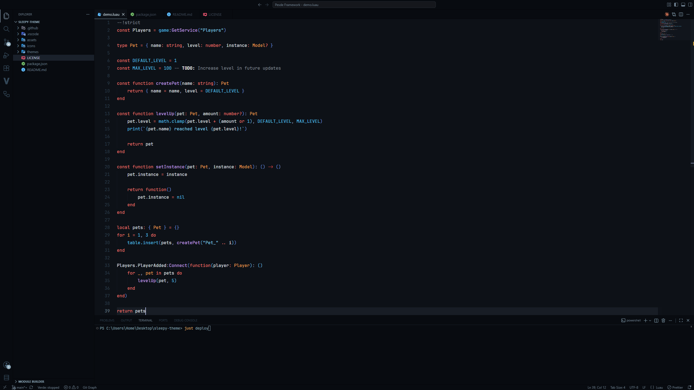
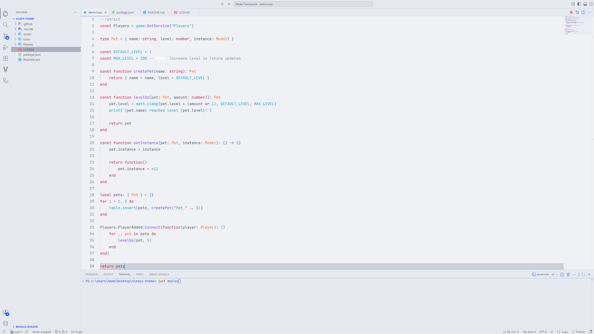

<p align="center">
  <p align="center">
	
  </p>
  <h1 align="center"><b>Sleepy Theme</b></h1>
</p>

<div align="center">

[](LICENSE)


</div>

A VSCode theme with [**GitHub Dark**](https://marketplace.visualstudio.com/items?itemName=GitHub.github-vscode-theme) syntax colors with a deep neutral background with a single soft accent, or... quite the opposite

## 📷 Previews

<details>
  <summary>🌙 Sleepy</summary>
  
</details>
<details>
  <summary>☀️ Awake</summary>
  
  I'm gonna revamp the light theme soon (at least the blue color), even if nobody use this if you have any suggestion, feel free to do a pr
</details>

## 🔧 Usage

### Releases

1. Download the `.vsix` file from the [Releases](https://github.com/PcoiDev/sleepy-theme/releases) page.
2. Open the Command Palette (`Ctrl+Shift+P` or `Cmd+Shift+P`) in VS Code.
3. Run the `Extensions: Install from VSIX...` command.
4. `Ctrl+Shift+P` → `Preferences: Color Theme` → select **Sleepy** or **Awake**.

### From source

```
just deploy
```

This builds the `.vsix` with `vsce` and installs it via `code --install-extension`.

## 🎨 Variants

- **Sleepy**: deep black-blue background with a single soft blue accent
- **Awake**: the light counterpart of Sleepy

## ✨ Features

- GitHub Dark-derived syntax highlighting, full semantic highlighting support
- Consistent hover/selection surfaces across editor, panel, lists, and buttons; no mismatched grays

## 🙌 Recommendations

### Settings

```jsonc
{
  "editor.fontFamily": "JetBrains Mono",
  "editor.fontLigatures": true,
}
```

### Icon theme

[Charmed Icons](https://marketplace.visualstudio.com/items?itemName=littensy.charmed-icons) by littensy pairs especially well with this theme.

---

<p align="center">
Sleepy Theme is released under the <a href="LICENSE">MIT License</a>.
</p>

<div align="center">

[](LICENSE)

</div>
